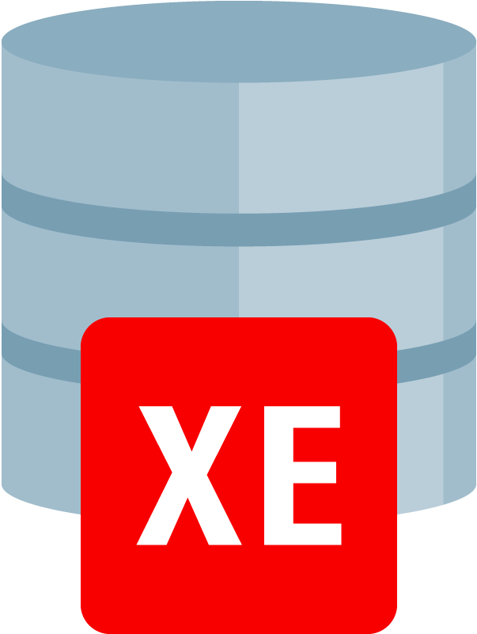
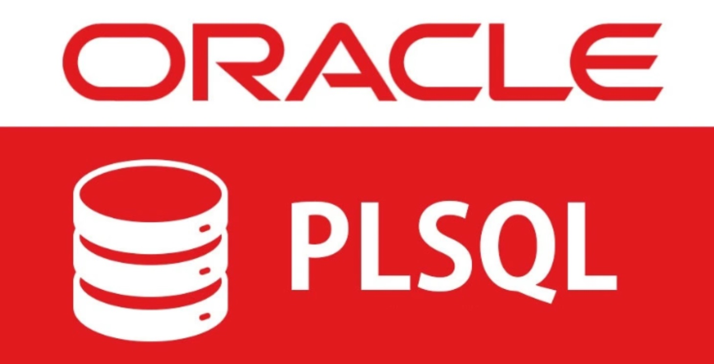
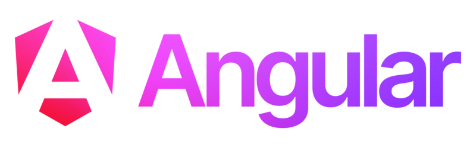

  

<h1 align='center'>Cinemaxx</h1>

### Plataforma de Reserva de Entradas de Cine

¡Bienvenido al repositorio de **Cinemaxx**! Este proyecto consiste en el desarrollo de una plataforma web para la reserva de salas y entradas de cine. La aplicación permite a los usuarios buscar funciones disponibles, seleccionar asientos en tiempo real y realizar pagos en línea. Además, los administradores pueden gestionar carteleras, películas, salas y horarios, mientras que los clientes pueden crear una cuenta, realizar reservas, cancelar boletos antes de la función y recibir confirmaciones por correo.

## Tecnologías Utilizadas

### Backend

- **Java** con **Spring Boot**: Para el desarrollo del servidor y la lógica de negocio.

  

- **Oracle Express**: Como base de datos para almacenar la información de usuarios, películas, salas, reservas, etc.

  

- **PL/SQL**: Para la creación de procedimientos almacenados y consultas avanzadas en la base de datos.

  

### Frontend

- **Angular** con **TypeScript**: Para la construcción de la interfaz de usuario interactiva y dinámica.

  

- **Bootstrap**: Para el diseño responsive y la estilización de componentes.

  

- **PrimeNG**: Para la implementación de componentes UI avanzados y personalizados.

  

- **SASS**: Para la escritura de estilos CSS más eficientes y mantenibles.

  

### Despliegue

- **AWS (Amazon Web Services)**: Para el despliegue de la aplicación en la nube, garantizando escalabilidad y alta disponibilidad.

  

## Características Principales

### Para Usuarios

- **Registro y Perfil de Usuario**: Los usuarios pueden registrarse y gestionar su perfil, ver historial de reservas y consultar facturas.
- **Búsqueda de Películas y Salas**: Los usuarios pueden buscar películas disponibles, ver horarios y seleccionar asientos en tiempo real.
- **Reserva y Pago**: Los usuarios pueden reservar entradas y realizar pagos seguros a través de integraciones con Stripe o PayPal.
- **Reviews**: Los usuarios pueden dejar reseñas sobre las salas de cine (atención, limpieza, etc.).

### Para Administradores

- **Dashboard de Gestión**: Los administradores pueden gestionar carteleras, películas, salas y horarios desde un panel de control.
- **Estadísticas en Tiempo Real**: Los administradores pueden visualizar datos sobre la afluencia de las salas, popularidad de las películas, ingresos generados y preferencias de asientos.
- **Análisis Demográfico**: Los administradores pueden consultar la demografía de los usuarios que frecuentan las sesiones.

## Estructura del Proyecto

El proyecto está organizado en los siguientes módulos:

- **Backend**: Contiene el código fuente del servidor desarrollado en Spring Boot, incluyendo controladores, servicios, repositorios y entidades.
- **Frontend**: Contiene el código fuente de la interfaz de usuario desarrollada en Angular, con componentes, servicios y estilos.
- **Database**: Contiene los scripts SQL para la creación de la base de datos en Oracle Express, incluyendo tablas, procedimientos almacenados y datos iniciales.
- **Documentación**: Contiene archivos relacionados con la documentación del proyecto, como diagramas de base de datos, flujos de trabajo y manuales de usuario.

## Requisitos Previos

Antes de comenzar, asegúrate de tener instalado lo siguiente:

- **Java JDK 21 o superior**
- **Node.js y npm** (para el frontend en Angular)
- **Oracle Express**
- **Angular CLI** (para el desarrollo del frontend)
- **Docker** (opcional, para el despliegue en contenedores)

## Contribuciones

¡Las contribuciones son bienvenidas! Si deseas contribuir al proyecto, por favor sigue estos pasos:

1. Haz un fork del repositorio.
2. Crea una rama para tu feature o corrección de bugs (`git checkout -b feature/nueva-funcionalidad`).
3. Realiza tus cambios y haz commit (`git commit -m 'Añadir nueva funcionalidad'`).
4. Haz push a la rama (`git push origin feature/nueva-funcionalidad`).
5. Abre un Pull Request.

## Licencia

Este proyecto está bajo la licencia **MIT**. Para más detalles, consulta el archivo [LICENSE](LICENSE).

## Contacto

Si tienes alguna pregunta o sugerencia, no dudes en contactarnos a través de [correo electrónico](oscper11@gmail.com) o abrir un issue en este repositorio.

---

¡Gracias por visitar el repositorio de **Cinemaxx**! Esperamos que esta plataforma sea de gran utilidad tanto para los usuarios como para los administradores de cines. 🎬🍿
